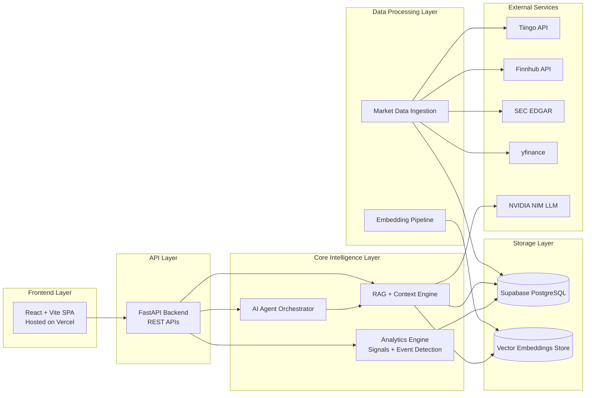

# Market Intelligence & Explanation Engine

Production grade market intelligence platform that detects price events, links them to news and signals, and generates grounded explanations. Built to turn noisy market data into structured, evidence backed narratives. Designed for async ingestion, scalable storage, and low latency retrieval for AI reasoning.

**[🚀 Visit the Live Application](https://stockmarketmind.vercel.app/)**

---

## System Architecture



The system is layered by responsibility: Frontend → API → Intelligence → Processing → Storage. Market data flows from external sources through ingestion and embedding pipelines into PostgreSQL and vector stores. The RAG engine retrieves evidence and grounds the AI agent's explanations.

---

## Features

- AI powered stock event explanation engine
- Statistical anomaly detection and event extraction
- Retrieval Augmented Generation (RAG)
- News to event contextual linking
- Technical indicator pipeline
- Vector similarity search with pgvector
- Multi source financial data ingestion
- REST API with async I/O

---

## Tech Stack

### Backend
- FastAPI
- SQLAlchemy Async
- asyncpg
- PostgreSQL
- pgvector

### AI / ML
- NVIDIA NIM (OpenAI compatible API)
- Embedding based retrieval
- RAG pipeline

### Data Sources
- Tiingo
- Finnhub
- SEC EDGAR
- yfinance

### Frontend
- React
- Vite

### Infrastructure
- Render (API)
- Supabase Postgres (DB)
- Vercel (frontend)

---

## System Workflow

1. Market and news data are ingested from external providers.
2. Technical indicators and statistical anomalies are computed.
3. Significant market events are stored in PostgreSQL.
4. News articles are embedded and linked to relevant events.
5. The agent retrieves structured context via RAG.
6. NVIDIA NIM generates grounded explanations from evidence.

---

## API Endpoints

| Endpoint | Description |
|---|---|
| `/api/v1/stocks/{symbol}` | Stock metadata |
| `/api/v1/stocks/{symbol}/prices` | Historical prices |
| `/api/v1/stocks/{symbol}/signals` | Technical indicators |
| `/api/v1/stocks/{symbol}/events` | Detected market events |
| `/api/v1/analysis/{symbol}` | Event analysis |
| `/api/v1/ask` | AI-powered market explanation |

---

## Database Design

PostgreSQL stores structured time series data, derived signals, and event metadata. pgvector is used to store embeddings for semantic retrieval. The core relationship is:

- Events reference computed signals and time windows.
- News articles are embedded and linked to events by relevance.
- Explanations are written back to the events table for traceability.

The system uses async SQLAlchemy for scalable I/O and to support concurrent inference workloads.

---

## AI / RAG Pipeline

- Retrieve: query relevant events/news using vector similarity and structured filters.
- Ground: construct a context bundle with evidence and metadata.
- Generate: NVIDIA NIM produces JSON structured explanations.
- Reduce hallucinations: responses are evidence backed and stored with traceable context.

---

## Deployment

| Service | Platform |
|---|---|
| Frontend | Vercel |
| Backend API | Render |
| Database | Supabase PostgreSQL |
| Vector Storage | pgvector |
| LLM Inference | NVIDIA NIM |

---

## Local Setup

1. Create and activate a Python environment.
2. Install dependencies:

```bash
pip install -r requirements.txt
```

3. Create a `.env` file (see below).
4. Initialize DB schema (only if tables are missing):

```bash
python scripts/init_db.py
```

This script also enables Row Level Security (RLS) on the public tables used by the app. With no RLS policies defined, anon/authenticated access via PostgREST is denied by default.
For Supabase, you can run the same statements from `scripts/sql/enable_rls.sql` in the SQL editor.

5. Run the backend locally:

```bash
uvicorn backend.api.main:app --reload
```

---

## Environment Variables

```env
DATABASE_URL=
SUPABASE_URL=
SUPABASE_KEY=
FINNHUB_API_KEY=
TIINGO_API_KEY=
EDGAR_USER_AGENT=
NVIDIA_NIM_API_KEY=
NVIDIA_NIM_BASE_URL=
NVIDIA_NIM_MODEL=
```

Never commit secrets to source control.

---

## Future Improvements

- Multi stock correlation analysis
- Real time streaming ingestion
- Temporal event clustering
- Portfolio level reasoning
- Multi agent orchestration
- Fine tuned financial LLM

---

## Screenshots

- Dashboard overview
- Ask flow / explanation view
- API docs (Swagger)
- Example event explanations

---

## Engineering Decisions

- Async architecture: enables concurrent ingestion + inference without blocking.
- pgvector: provides fast semantic retrieval inside Postgres.
- RAG: grounds model outputs in evidence to improve trust.
- Supabase: managed Postgres with operational simplicity.
- Statistical anomaly detection: reliable, explainable event triggers before LLM synthesis.


## corrections need to make 
- add correct sources